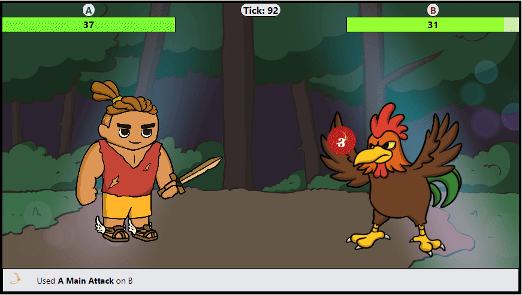

# Introduction to IOTA Heroes

**IOTA Heroes** is a captivating web3 game set in the enchanted lands of Fortuvia. In this blockchain-based universe, every hero is a unique Non-Fungible Token (NFT) with distinct visuals and attributes. As a player, you can own, train, and embark on adventures with your heroes, battling fearsome monsters, discovering ancient treasures, and crafting powerful items.

## Game Overview

- **Adventures:** Send your heroes on quests to battle monsters and gather loot in the PvE (Player versus Environment) mode. Future updates will introduce PvP (Player versus Player) dueling and other exciting activities.
  
- **Training:** Train your heroes at various facilities in the village to improve their skills and prepare them for tougher challenges.
  
- **Trading and Crafting:** Trade items with other players at the Trading Post, or craft new, unique items at the Reforging Station.

- **Community:** Engage with a lively community of fellow adventurers, participate in events, tournaments, and explore a player-driven economy.

## Blockchain Integration

IOTA Heroes leverages blockchain technology to offer a transparent and fair gaming environment. Here are some key blockchain features:

- **Ownership:** All heroes and items are tokenized as NFTs, providing true ownership to players.
  
- **Marketplace:** A decentralized marketplace for trading heroes and items, fostering a player-driven economy.
  
- **Play & Earn:** Engage in Play&Earn activities to earn rewards while enjoying the game.

## Getting Started

Ready to dive into the world of IOTA Heroes? Follow our [Getting Started Guide](./account.md) to create your account and acquire your first hero.

For developers interested in extending the IOTA Heroes experience, check out the [Developer Guide](../developer-guide/smart-contracts.md).

Explore, adventure awaits!
